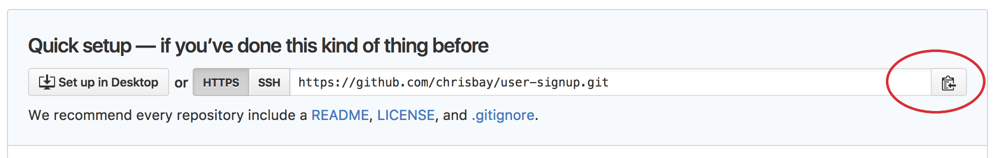

Your assignment is simply to complete Part 2 of CS253's Problem Set 2, specifically the item called [Quiz: User Signup][user-signup].

This assignment is all about incorporating forms into your web app, validating the user's input, and providing useful feedback to the user when their input is rejected.

## Setting Up

First, set up your project by creating it, initializing a local Git repository, and connecting it to a remote repository on GitHub. Follow the steps below:

1. Create a new Google App Engine app called `user-signup`.

1. At the command-line, use `git init` to initialize your project as a local Git repository.

1. On GitHub, create a new repository named `user-signup`, and copy the repository URL:

    

1. Back in your terminal, connect your local repository to the remote repository:

    ```nohighlight
    $ git remote add origin PASTE_REPO_URL_HERE
    ```

1. You can verify that your remote repository has been properly configured by running:

    ```nohighlight
    $ git remote -v
    origin	https://github.com/chrisbay/user-signup.git (fetch)
    origin	https://github.com/chrisbay/user-signup.git (push)
    ```

## Doing Work

Your page does not have to look exactly the same as their example (here's [our version][signup-example], by the way), but you must have all the same functionality. The notes underneath the video spell out exactly what is required, but here's a summary:
1. If the user's form submission is not valid, you should reject it and display some feedback to inform them of what they did wrong. The following things should trigger an error:
  - The user does not enter a username
  - The user's username is not valid -- for example, contains a space character. Full spec is included in the notes underneath the video.
  - The user's password and password-confirmation do not match
  - The user provides an email, but it's not a valid email.

1. Each feedback message should be next to the field that it refers to.

1. For the username and email fields, you should preserve what the user typed, so they don't have to retype it. With the password fields, you should clear them, for security.

1. **IMPORTANT:** In your solution, please *do not use templates.* For this assignment, the important concept is handling form submissions. We do not want you to be distracted by trying to use templates (that'll be next time!).

    Additionally, you may have noticed that Udacity provides a "solution" to the problem... you are free to look at their solution, but obviously you should not try copy it. Their solution makes use of templates, so copying it will be difficult anyway.


### Submit

To turn in your assignment and get credit, follow the [submission instructions][submission-instructions].

> *NOTE:* Remember that you should ignore any Udacity instructions about hosting your app out on the internet and posting the link so they can grade it. You don't have to submit your work to Udacity, you just have to submit to LaunchCode by demoing your code to your TF.


[pset2]: https://classroom.udacity.com/courses/cs253/lessons/48756009/concepts/485384170923#
[user-signup]: https://classroom.udacity.com/courses/cs253/lessons/48756009/concepts/485084220923#
[caesar-example]: https://launchcode-demos.appspot.com/caesar
[signup-example]: https://launchcode-demos.appspot.com/signup
[submission-instructions]: ../
