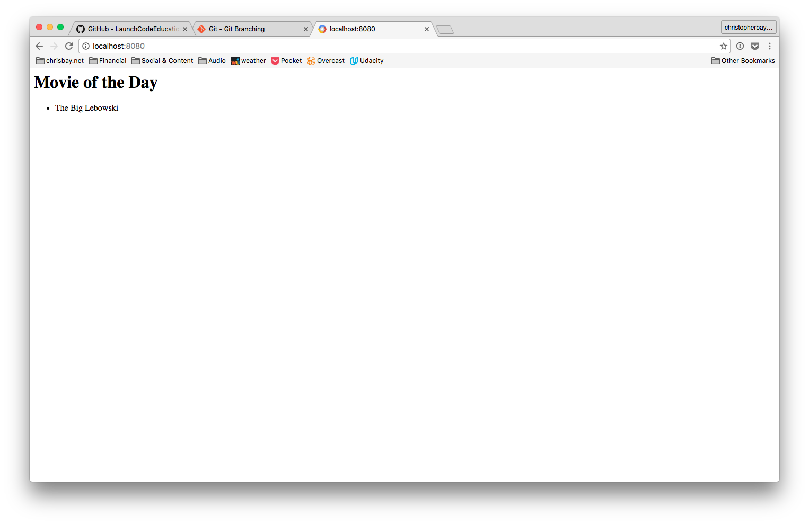

This studio marks the beginning of our exploration of the mechanics and ideas involved in building full-stack web applications. The term **full-stack** simply means that we'll look at every aspect of web applications, from the pages that a user views and interacts with, to the Python code that decides how to handle user submissions and requests, to the database that stores information.

Starting today, the majority of in-class sessions will revolve around building a class project together. Each day of class, we will add a little bit more onto the project: your instructor will live-code some new feature, and then for Studio you will be asked to add a little more.

The mechanics of how you will work on Studios will be the same for nearly every class going forward, so we'll cover them in a bit more detail this time, as a proper introduction to this strategy.


### FlickList

Our app will be called *FlickList*, as in: a list of "flicks" or movies. It'll start out small, but within a few weeks it will have a lot of useful functionality that will allow users to create a list of movies they want to see, edit the list, mark movies as watched, and rate the movies they have watched.

### Project setup

Let's do some setup work to get our project ready. We'll only have to do this once.

#### Clone the repository

In a terminal, navigate to whichever directory you use to store your code projects. Leave the terminal open, and visit the [FlickList repository page on GitHub](https://github.com/LaunchCodeEducation/flicklist-python). Copy the clone URL from the "Clone or download" dropdown.

Back in your terminal:
```
$ git clone [URL]
```

Where [URL] is replaced with the repository URL.

This creates a copy of the repository on your laptop.

#### Create new App Engine app

Now, open the Google App Engine Launcher. Create a new app using the app ID `flicklist-python`. The application directory should be *one level above* the repository directory that was just created by cloning the repository. So, if your copy of the repository is in `/home/student/code-projects/flicklist-python`, then you would set the application directory to `/home/student/code-projects/`. In previous usage of Google App Engine Launcher, the tool created a new directory for us using the specified project ID. In this case, however, we want to use the directory that is already there. If we get the application ID and directory settings correct, Google App Engine will do this just like we want.


Recall that you can set the port settings in the dialog to almost anything you like, as long as you know to access your app in the browser using the correct port. Here, we uses 8000 and 8080 for admin and application ports, respectively.

### Walkthrough 3: Hello, Movies!

In class, we'll walk through the steps to set up our new application that are outlined above. We'll discuss the dynamics of web applications:
* How is a dynamic web application different form a static website, and what can a dynamic web app do that a static site cannot?
* What exactly is the application, and how does it "run"?
* How do HTTP requests and responses work?
* GET and POST requests types
* Review of Python class syntax, and the `self` parameter
* Routes in a web appliction (i.e. how does a specific request get matched with a specific handler class based on the URL?)

We'll also add a bit of code to display a new heading and a "Movie of the Day", which is really just a hard-coded string. You will make this more interesting during the studio.

### Checking out the Studio code

First, make sure you are in your `lc101/` folder. Then, clone our repository:

```nohighlight
git clone https://github.com/LaunchCodeEducation/flicklist-python.git
```

You should now have a new folder in your directory called `flicklist-python/`. Navigate into that folder:

```nohighlight
cd flicklist-python
```

We have already set up a bunch of "jumping off" points within this repository, one for each studio you will do.

For today's studio, checkout the `studio3` branch:

```nohighlight
$ git checkout studio3
Branch studio3 set up to track remote branch studio3 from origin.
Switched to a new branch 'studio3'
```

This checks out a specific version of the code (called a **branch**) from the remote origin repository. Think of a branch as a parallel version of the main codebase in the repository. We can work here, make changes, and check them in without affecting the main codebase (usually called the `master` branch). The nice thing about this workflow is that you can work on today's studio without messing up your "starting point" for the next class, which is safely contained in a different branch called `studio4`.

### Studio 3: Movie of the Day

Before you get started, fire up the FlickList app using Google App Engine Launcher and visit the home page in a browser. You should see a page that looks like this.



If you don't see something like the above, make sure the app is running and check the URL.

##### Your Task

Currently, this app is kind of boring, because the movie of the day is always *The Big Lebowski*. What if, each time you visit the page, it randomly surprises you with a different movie? That would be much more exciting. Your job is to implement this random movie feature.

In Atom, open up the `flicklist-python` folder, and then the `main.py` file. Notice that you have a couple of TODOs, noted by comments. Completing these will upgrade our app so that rather than displaying the same movie each time, instead it displays a random movie from a list. Here are some more details on what you need to do.

1. Inside the `getRandomMovie` method, create a Python list that contains at least 5 movie title strings.
1. In the same method, choose one of the titles randomly, and modify the return statement so that instead of the hard-coded value "The Big Lebowski", it returns the randomly selected title. Here are some tips:
    * Recall that we can generate random numbers in Python with [the `random` module](https://docs.python.org/2/library/random.html). Add `import random` to the top of `main.py` to make this module available to our code. Read the module documentation to determine which method within the module is best for the task at hand.
    * Write your code so that if you were to add or remove some movies from your list, it will still randomly choose one, no matter how many items are in the list. In other words, your code should not contain a "magic number" like `5`.
1. In addition to today's movie, add another section of the page that informs people what tomorrow's movie will be. Back in your `get` method, add another chunk of HTML to your response string. You can do the same basic thing again: an `<h1>` element, with a `<p>` element underneath it.

If you complete the steps above, you should see that the "movie of the day" changes each time you refresh the page!

Hopefully this gives you some sense for the difference between a static web site and a dynamic web app running on a server. Even something as simple as our "random movie of the day" page would be impossible to implement as a static site. In order to dynamically build HTML content "on the fly", like we did here, you need a programming language like Python running on the back-end.

When you're done with your studio code (or even if you're not done, but you are about to pack up your computer), make sure to commit your changes:
```
$ git add .
$ git commit -m "USEFUL MESSAGE"
```

[get-the-code]: ../getting-the-code/
