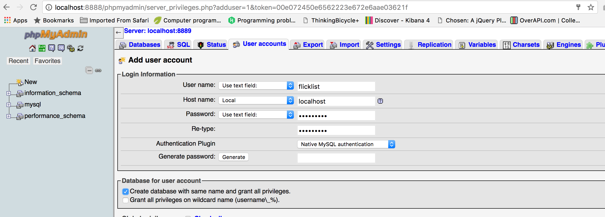

In this studio we will build persistence into our app. Finally, our hypothetical user will be able to add a new movie to the list, close the window and go eat a sandwich, forget what movie she wanted to watch, and then come running back to our site, and the same movie will still be faithfully sitting in her list so she can go stream it on our other awesome website, FlicksNet.

We'll start using a term and associated acronym that is common when connecting applications to databases: **object-relational mapping (ORM)**. Applications store information in the form of *objects* and databases store data in the form of *relational data* (tables). An ORM library or module will often do much of the heavy lifting for us, when it comes to translating back and forth between these differing contexts.

## Walkthrough

For today's walkthrough, we'll be looking at three different branches. On the `walkthrough6` branch you'll see the solution to last week's studio. But our work today will begin on the `walkthrough6a` branch, where you can see we've made some significant changes to our code. We've refactored our code in a way that is very similar to how you refactored your code in Class 9's prep work as you coded along with the video lessons. Specifically, we've added code to support our chosen ORM implementation, SQLAlchemy, and we've made a new persistent class called `Movie`. To see the differences between the the solution to last week's studio and our code now, type this command in your terminal: `git diff walkthrough6 walkthrough6a`.

The most powerful line in this whole batch of changes is this:

```python
def get_current_watchlist():
    return [movie.name for movie in Movie.query.all()]
```

Your instructor has already created a user and database for `flicklist` in their *phpMyAdmin* (you will do the same in the Studio portion below), so they can run the code below in a Python shell to create the `movie` table. Now that we've added `if __name__ == "__main__":` to prevent `app.run()` from running when we load `main.py` as a module, we can now safely import `db` and `Movie` from `main.py`:

```nohighlight
(flask-env) $ python
>>> from main import db, Movie
/home/dm/miniconda3/envs/flicklist/lib/python3.6/site-packages/flask_sqlalchemy/__init__.py:839: FSADeprecationWarning: SQLALCHEMY_TRACK_MODIFICATIONS adds significant overhead and will be disabled by default in the future.  Set it to True or False to suppress this warning.
>>> db.create_all()
>>> db.session.add(Movie('Mulan'))
>>> db.session.add(Movie('Rushmore'))
>>> db.session.add(Movie('Damsels in Distress'))
>>> db.session.commit()
>>> Movie.query.all()
[<Movie 'Mulan'>, <Movie 'Rushmore'>, <Movie 'Damsels in Distress'>]
```

Now when we fire up the app and view it, we see those movies in the watchlist!

But we've still got some work to do to fully utilize our new database capabilities. In particular:

- Adding movies to the watchlist isn't *persistent* - if we type in a name and click *Add it*, then go back and reload, nothing has changed.
- Clicking on *I Watched It!* makes no persistent changes, either.
- Rating movies isn't persistent.

Today we will change all these functionalities to be persistent. We'll walk through the first two together, then you'll handle the last one on your own in the Studio.

### A List of Movie Instances

Our next change is going to be a massive breaking change to our application. Up until now, we've been representing movies as strings of their names. The time has come to represent movies as instances of the `Movie` class. This will rip through our application, breaking lots of stuff. We'll rename lots of variables so it's clear when we're talking about a `Movie` object, and when we're talking about a movie name (a property of `Movie` objects). You can explicitly see our changes by running `git diff walkthrough6a walkthrough6b`.

For example, notice how we update our `get_current_watchlist` function to get a list of `Movie` objects from the database rather than return a list of strings, as we did previously.

Our code previously returned a list of strings:

```python
def get_current_watchlist():
    # old: list of strings
    return [movie.name for movie in Movie.query.all()]
```

And we refactored it to return a list of `Movie` objects:
```python
def get_current_watchlist():
    # new: list of Movie instances
    return Movie.query.all()
```

And notice how we have to rework the templates to call `.name` on the model object when we want a human-readable version of the movie name, and `.id` when we want to reference a specific row in our movie table.

In this batch of changes, we've changed our most important data structure and we've made it possible to add movies to the watch list from the web browser. Hooray! Cool stuff! The world is our oyster.

### Watching Movies

In the next batch of changes, we'll modify the *I Watched It!* button to change the database, and truly cross off the movie in the database, persistently. You can view these changes by running the command `git diff walkthrough6b studio6`. We also finish our transition from strings to `Movie` objects by modifying the ratings templates.

## Studio

Now that we have some database functionality wired into our application, let's continue to convert our app to use the database. Our next task is to implement persistent ratings, so a user can rate a movie and the information is stored in the database for later.

### Checking out the Studio code

Follow the [instructions for getting the code][get-the-code] in order to get the starter code for `studio6`.

You should have already installed MAMP locally but if you need a refresher it is in [Class 8 Prep Work](/class-prep/8).

### Your Tasks

Here's an outline of the steps we'll take. We provide additional details below.

1. Create MySQL user and database
2. Initialize your database
3. Run the flicklist application
4. Modify flicklist to store movie ratings

### Create MySQL User and Database

Now we will need to create a database locally (on your computer). We will use the same names as we did in the walkthrough.

Make sure your servers are running with MAMP. Go to *phpMyAdmin* in your browser and create a user named *flicklist* with the password *MyNewPass*. Check the box that says *Create database with same name and grant all privileges* then press the *Go* button in the bottom right-hand corner.



### Initialize Your Database

Make sure your flask environment is activated. **For this and future Studios** we'll use the `flask-env` virtual environment that was created while you coded along with the video lessons. Since you already installed the necessary conda packages in the [Database Configuration](../../../videos/get-it-done/db-configuration) lesson, your `flask-env` is ready to use SQLAlchemy.

<aside class="aside-warning" markdown="1">
If you did not install `flask-sqlalchemy` and `pymysql` into your virtual environment, stop and do so now using the instructions linked above.
</aside>

Reenact the python shell session from the walkthrough. Here it is again:

```nohighlight
(flask-env) $ python
>>> from main import db, Movie
/home/dm/miniconda3/envs/flicklist/lib/python3.6/site-packages/flask_sqlalchemy/__init__.py:839: FSADeprecationWarning: SQLALCHEMY_TRACK_MODIFICATIONS adds significant overhead and will be disabled by default in the future.  Set it to True or False to suppress this warning.
>>> db.create_all()
>>> db.session.add(Movie('Mulan'))
>>> db.session.add(Movie('Rushmore'))
>>> db.session.add(Movie('Damsels in Distress'))
>>> db.session.commit()
>>> Movie.query.all()
[<Movie 'Mulan'>, <Movie 'Rushmore'>, <Movie 'Damsels in Distress'>]
```

### Run the Existing FlickList

Exit the Python shell and start the *FlickList* program by running this command in the terminal:
`python main.py`.

In your browser, add one movie then cross it off.

### Modify FlickList to Store Movie Ratings

- Change `main.py`'s `Movie` class to have a ratings property. Make this a string property, since it will hold values `'*'`, `'**'`, `'***'`, and so on.
- Drop the `movie` table using the Python shell. After starting up the shell, import `db` and `Movie` as we did above, then use the command `db.drop_all()`. Since you have just changed the model, we'll need to recreate the table from scratch.
- Reinitialize your database by running `db.create_all()`, as we did above.
- Update `get_watched_movies` to return all unwatched movies in the database, as a list of `Movie` objects. It currently returns a static list of movies.
- Refactor the `rating.html` template so that it works when `movies` is a list of `Movie` objects, rather than a list of strings.
- Change the behavior of the `rate_movie` function in `main.py` so that when a user rates a movie it actually stores the rating using the column/property you just added.
- Display the stored ratings on the ratings page by pre-populating the select box with each movie's old rating, if there is a rating for the movie (see the `TODO` in `ratings.html`). The `selected` attribute of the `option` tag will come in handy. Read more about it at [w3schools](https://www.w3schools.com/tags/att_option_selected.asp).

### Give Yourself a Hand

If you made it this far, you've completed a challenging studio. Congratulations!  And if you don't get it right away, don't give up. Keep on trying: be *persistent*!


<aside class="aside-note" markdown="1">
If you want to test your queries in the MySQL console, you can do so in the phpMyAdmin interface. Go to the left tab and click on the database name *flicklist* then on the second-to-top row tab click *SQL*.
<br/>
For those of you accustomed to accessing this via the command line, you will need to specify which mysql to use with a command like:
```nohighlight
/Applications/MAMP/Library/bin/mysql -uflicklist -p
```
</aside>

[get-the-code]: ../getting-the-code/
