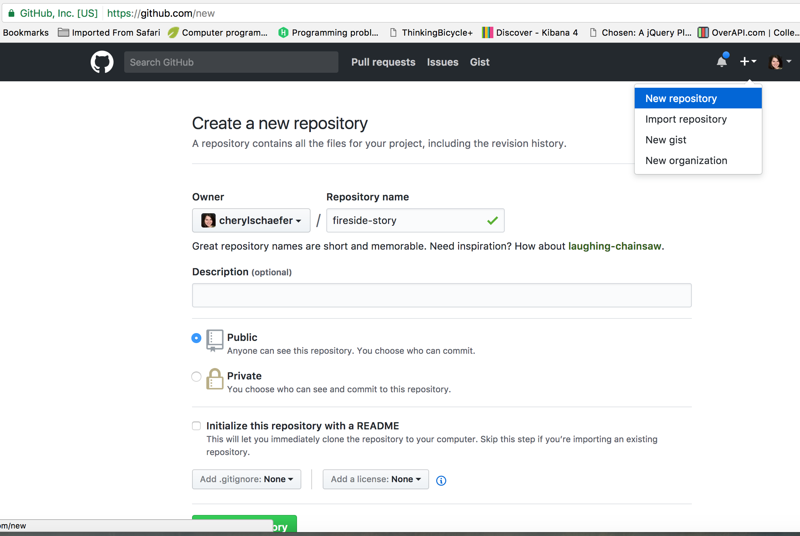
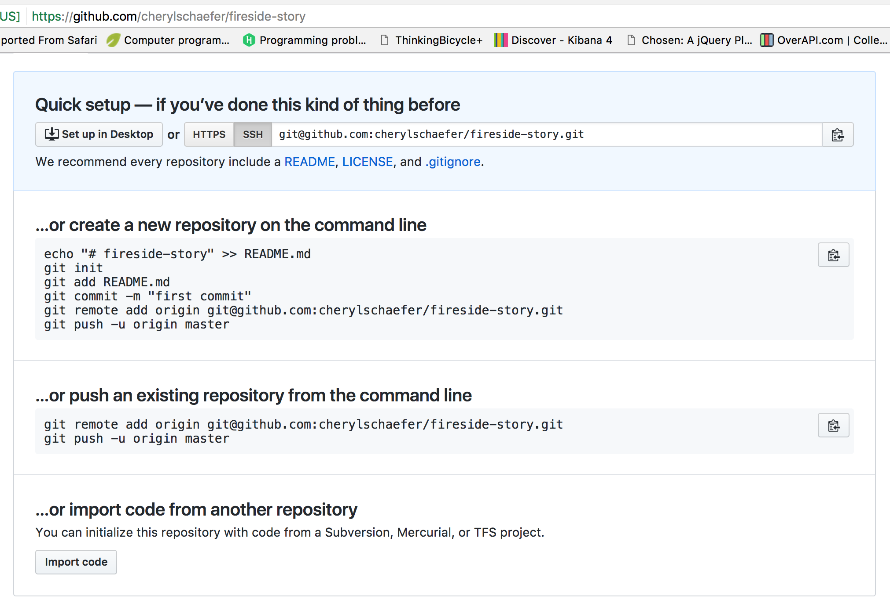

## Getting Ready: Code Together

Coding together allows you to work as a team so you can build bigger projects, faster.

In this studio, we will practice common git commands necessary when multiple people are developing on the same code base.

## Walkthrough

TODO

## Fireside Story

We are going to play a game. We will play it just like you'd play around a campfire, but on a web page.

First, find a new friend to play the game with.

### Player 1

Navigate to your development folder. Follow these instructions to create a new project.

```
$ mkdir fireside-story
$ cd fireside-story
$ git init
```

In that directory, open a new file `index.html` in the editor of your choice. Paste in this code:

```html
<html>
  <body>
    <p>It was a dark and stormy night...</p>
  </body>
</html>
```

Let's check that our html looks okay by opening it in a browser. The URL will look something like this: `file:///Users/cheryl/Development/fireside-story/index.html`.

TODO screenshot

Let's stage and commit this file.

<pre><code class="nohighlight" style="color: #333">$ git status
On branch master

Initial commit

Untracked files:
  (use "git add <file>..." to include in what will be committed)

    <span style="color: red">index.html</span>

nothing added to commit but untracked files present (use "git add" to track)</code></pre>
<pre><code class="nohighlight" style="color: #333">
$ git add .
$ git status
On branch master

Initial commit

Changes to be committed:
  (use "git rm --cached <file>..." to unstage)

    <span style="color: green">new file:   index.html</span>
</code></pre>
```
$ git commit -m 'started story'
[master (root-commit) e1c1719] started story
 1 file changed, 5 insertions(+)
  create mode 100644 index.html
```
```
$ git log
commit longuniquehashofdigitshere
Author: Cheryl <cherylschaefer@gmail.com>
Date:   Wed Apr 5 10:55:56 2017 -0500

    started story
```

Great! We've got our project going locally, but we're going to need to make it accessible for player 2 also. Let's push this project up to Github.

Go to your Github profile in a web browser. Click on the + button to add a new repository (repo).



Fill in the name and description. Uncheck the "initialize with README" and Click Create.

TODO circle the middle set of directions in red


Now go back to your terminal and follow the instructions shown on Github which should be very similar to this:

```
$ git remote add origin git@github.com:cherylschaefer/fireside-story.git
$ git push origin master
```

Now you should be able to confirm that Github has the same version of the project you have locally. (File contents in browser match those in terminal.)

### Player 2

Clone the project down onto your computer by following these instructions.

Go to player 1's github profile and find the fireside-story repo. Click on the green "Clone or download" button. Copy the url to your clipboard.

TODO screenshot

In your terminal, navigate to your development folder and clone down the repo. The command should look something like this.

```
git clone git@github.com:cherylschaefer/fireside-story.git
```

Now you can add a line to the story! Open the `index.html` file in your editor and add the next line of the story. Then commit your change.

```
$ git status
$ git add index.html
$ git commit -m 'added second line of story'
```

Now we need to push up your changes so player 1 can use them as well.

```
$ git push origin master
TODO Error message
```

Great error message! It let us know exactly what went wrong - player 2 does not have security permissions to write to player 1's repo. Let's go fix that.

### Player 1

In your web browser, go to your fireside-story repo. Click the `Settings` button then click on `Collaborators`. Enter in player 2's Github username and click `Add Collaborator`.

### Player 2

You should receive an email invitation to receive permissions to this repo from player 1 through Github.

Now let's go enter that command again to push up our code.

```
$ git push origin master
TODO Success message
```

Both players should now see the second line of the story on Github in the browser.

### Player 1

Player 1 you might notice you don't have the second line on your computer. Go to the terminal and enter this command to pull that updated code in locally.

```
$ git pull origin master
TODO message
```

Now go in your editor, add and commit a third line of story and push it up.

### Player 2

Player 2 you might notice now YOU don't have the third line on your computer. Go to the terminal and enter this command to pull that updated code in locally.

```
$ git pull origin master
TODO message
```

Now go in your editor, add and commit a fourth line of story and push it up.

You can both play like this for a while! But let's say player 2 wants to work a little extra on the project. You're not sure player 1 is keen on this change so let's put it in a branch.

```
$ git checkout -b add-styling
TODO message
```

Open a new file, style.css and paste this code in:
```
body {
  color: white;
  background-color: black;
}
```

Now link it in your `index.html`. It should look something like this:

```html
<html>
  <head>
    <link rel="stylesheet" type="text/css" href="style.css">
  </head>
  <body>
    <p>It was a dark and stormy night...</p>
    ... your content here
  </body>
</html>
```

Now stage and commit the new file and changes to the existing file.

```
$ git add .
$ git commit -m 'added style.css'
$ git push
```

You should both now be able to see a second branch appear in your repo in the browser. On your command line, you can type this command to see a list of the available branches: 

```
$ git branch
```

In your browser, go to the github project. Click on branches and the new branch name.

TODO screenshot

In the upper right-hand corner, click `Compare` to see a diff between this feature branch and the master branch.

TODO screenshot

If you are happy with your changes, click `Create a Pull Request`. Add some text in the description box to let player 1 know what you did and why.

TODO screenshot

### Player 1

You will notice that you do not see this new `style.css` file locally. Type this command to see what branches are on your local coputer:

```
$ git branch
TODO message
```

If you want to work with the branch before merging it in, you can do so by typing these commands:

```
$ git fetch
TODO message
```
```
$ git checkout add-styling
TODO message
```

Make a change and commit to this branch if you'd like -- you will see that the pull request in Github is updated to reflect the changes you've added. The context in the description box is not though, so be sure to add comments to the pull request to explain what you did and why.

To go back to the main branch type these commands:

```
$ git checkout master
TODO message
```

You will see you no longer have those changes that are in the add-styling branch. Let's go merge those changes in.

Go to the repo in Github. Click on `Pull Requests`. Explore here and see all the information Github shows you about the changes made.

TODO screenshot

When you're happy with the changes, merge them in. Click `Merge Pull Request` then `Confirm Merge`.

TODO screenshot

Now you will need to pull updates to your master branch locally.

```
$ git pull origin master
```

TODO lalalaaa both edit a file so merge conflicts arise


### Resources

* [Adding Another Person To Your Repository](https://help.github.com/articles/inviting-collaborators-to-a-personal-repository/)
