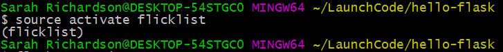

## Build a Development Web Server

In this tutorial, we'll configure and build a web server. The
configuration will be the hard part. When we're done, we'll be able to
visit the server in our browser, and it will display this heartening message:


### Founding your project and installing software

First make a directory for your project, and cd (change directory) into it:

```
$ mkdir hello-flask
$ cd hello-flask
```

To download the flask library, we're going to need a way to store
libraries. So that this doesn't cause version mismatch issues with
other versions of Python on your system - including system libraries
which might be using Python - we'll install a virtual environment and
host all our libraries within it.

<aside class="aside-note" markdown="1">
Here, we're using the term "virtual environment" loosely. Rather than starting a full virtual machine, we're really just changing the PATH environment variable, which controls the order of directories that bash searches for programs.

```
(flask) $ echo $PATH
/home/dm/hello-flask/flask/bin:/home/dm/.rbenv/plugins/ruby-build/bin:/home/dm/.rbenv/shims:/home/dm/.rbenv/bin:/home/dm/bin:/home/dm/.local/bin:/usr/local/sbin:/usr/local/bin:/usr/sbin:/usr/bin:/sbin:/bin:/usr/games:/usr/local/games:/snap/bin:/usr/lib/jvm/java-8-oracle/bin:/usr/lib/jvm/java-8-oracle/db/bin:/usr/lib/jvm/java-8-oracle/jre/bin
```
</aside>

To create a virtual environment with Conda, we'll do the following:

1. In your hello-flask directory, create a virtual environment named `flicklist` like so:  
`conda create -n "flicklist"`


2. Activate the virtual environment using `source activate flicklist`



3. Install flask into your virtual environment with the command `conda install flask`


*Tip:* If you need to deactivate the virtual environment, use the command ``source deactivate``.


<aside class="aside-note" markdown="1">
The above pictures show how these commands will look in Git Bash. Mac Terminal will look slightly different. 
</aside>

Now we're ready to build our web server!

### Build a webserver, line by line

In your text editor, create a new file named `main.py`. The name
`main` isn't special, we just picked it. The suffix `.py` means it's a
Python source file.

Type this in, and think about every line as you do:

```python
from flask import Flask

app = Flask(__name__)

@app.route("/")
def index():
    return "Hello World"

app.run()

```

What's all this do?

- `from flask import Flask`: this imports the `Flask` class from the `flask` module.
- `app = Flask(__name__)`: app will be the object created by the constructor `Flask`. `__name__` is a variable controlled by Python that tells code what module it's in.

- `@app.route("/")`: this is a decorator that creates a mapping between the path - in this case the root, or  "/"  and the very next definition...
- `def index():`: Ah, familiar ground! We define `index` a function of zero variables
- `  return "Hello World"`: ... and return a string literal.
- `app.run()`: Pass control to the Flask object. The run function loops forever and never returns, so put it last.

Here goes. Go to the shell and start things up. The output should look like:

```bash
$ python main.py
 * Running on http://127.0.0.1:5000/ (Press CTRL+C to quit)
127.0.0.1 - - [10/Apr/2017 17:02:19] "GET / HTTP/1.1" 200 -
```

From the computer running this process, point your browswer at http://localhost:5000/ and see what's up. Maybe this?!:


If so: congrats! You've built a dynamic web app!

You might see this error:

```nohighlight
Traceback (most recent call last):
  File "main.py", line 1, in <module>
    from flask import Flask
ImportError: No module named flask
```

This means your virtualenv is not running. Enter this command to start it: `source venv/bin/activate` and then try again.
